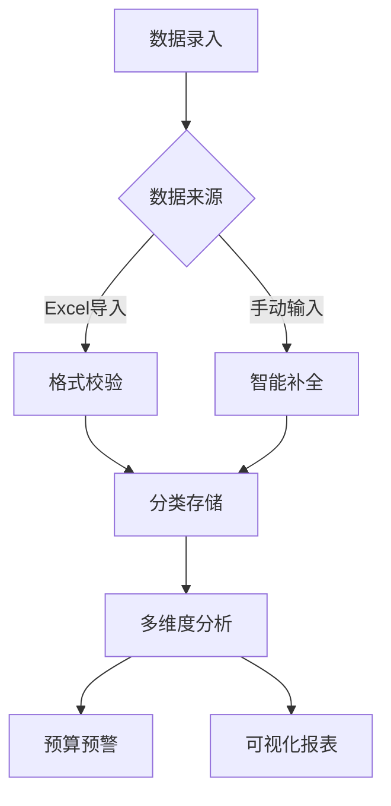

# 智能记账App需求文档

## 1. 项目概述

### 1.1 用户场景
- 自由职业者管理多源收入
- 家庭主妇跟踪月度支出
- 学生群体管理生活预算
- 小微企业主监控经营现金流

### 1.2 核心流程

本项目旨在开发一款智能记账App，帮助用户有效管理个人财务流水，提供数据分析、预算管理等功能，实现财务可视化与智能化管理。

## 2. 功能需求

### 2.1 核心功能
- 数据导入与解析
  - 支持Excel文件导入（如20220219130307.xlsx）
  - 手动添加交易记录
  - 数据校验与错误提示

- 交易分类管理
  - 预设常用交易类别
  - 自定义分类功能
  - 智能分类建议

- 流水分析与统计
  - 多维度收支统计
  - 分类支出占比分析
  - 可视化趋势图表

- 预算管理
  - 月度预算设置
  - 预算进度提醒
  - 超支预警功能

### 2.2 扩展功能
- 多账户管理
- 外币交易支持
- 发票管理
- 投资理财记录

## 3. 非功能需求

### 3.4 安全实施方案
- 文件存储安全：
  - 上传文件隔离存储
  - 定期清理7天前的临时文件
  - 文件访问权限控制(600)
- 加密算法：AES-256-GCM
- 密钥管理：HSM硬件模块
- 认证机制：JWT+Refresh Token双令牌
- 备份策略：每日本地加密快照+增量云端同步

### 3.5 测试用例
测试脚本存放路径：`src/tests/`
| 模块 | 测试项 | 预期结果 | 测试类型 |
|------|--------|----------|----------|
| 数据导入 | 上传损坏Excel | 显示具体错误位置 | 单元测试(unit) |
| 智能分类 | 输入"7-11买咖啡" | 自动归类为餐饮支出 | 集成测试(integration) |
| 预算预警 | 设置月预算3000元 | 支出达80%时推送提醒 | 端到端测试(e2e) |

### 3.6 版本管理
- Git分支策略：Git Flow
- 发布周期：每月最后一个周五
- 热修复流程：从production分支创建hotfix
- 版本号规范：语义化版本控制2.0.0

### 3.1 性能要求
- 数据导入响应时间 < 2s
- 报表生成时间 < 5s
- 支持同时处理10000+条交易记录

### 3.2 安全要求
- 本地数据加密存储
- 用户认证与授权
- 数据备份与恢复

### 3.3 可用性
- 界面简洁直观
- 操作流程简单
- 提供使用帮助文档

## 4. 技术架构

### 4.3 数据库设计
**交易记录表(transactions)**
| 字段名 | 类型 | 说明 |
|--------|------|-----|
| id | UUID | 主键 |
| amount | DECIMAL(10,2) | 交易金额 |
| category | VARCHAR(50) | 分类标签 |
| transaction_date | DATETIME | 交易时间 |
| memo | TEXT | 备注信息 |
| is_income | BOOLEAN | 收入/支出 |

### 4.4 智能分类模型
- 采用BERT+CRF混合模型
- 训练数据：历史交易备注文本
- 特征工程：金额区间、交易时间、文本关键词
- 准确率目标：初始版本≥85%

### 4.5 API接口规范
```json
{
  "POST /api/transactions": {
    "headers": {
      "Authorization": "Bearer <token>"
    },
    "body": {
      "amount": 199.9,
      "date": "2024-03-15",
      "memo": "超市购物"
    }
  }
}
```

### 4.1 前端
- 框架：React Native
- 图表库：ECharts

### 4.2 后端
- 语言：Node.js
- 框架：Express
- 数据库：SQLite（本地）、MongoDB（云端）

### 4.6 项目目录结构
```
AIBookkeeping/
├── src/
│   ├── mobile/        # React Native移动端代码
│   ├── server/       # Node.js后端服务
│   │   └── uploads/  # 用户上传文件存储目录
│   ├── database/     # SQLite本地数据库配置
│   └── tests/        # 测试用例目录
│       ├── unit/      # 单元测试
│       ├── integration/ # 集成测试
│       └── e2e/       # 端到端测试
├── docs/
│   ├── technical/    # 架构设计文档
│   └── user_guide/   # 用户手册
├── config/
│   ├── env.development # 开发环境配置
│   └── env.production  # 生产环境配置
├── scripts/          # 构建部署脚本
├── .gitignore
├── package.json
└── README.md         # 项目启动说明
```

**本地开发环境要求**:
- Node.js 18.x
- React Native 0.72
- Xcode 15/iOS Simulator (Mac)
- Android Studio (Windows)

## 5. 开发计划
- 阶段1：核心功能开发（4周）
- 阶段2：扩展功能开发（2周）
- 阶段3：测试与优化（2周）

## 6. 交付物
- 可运行App
- 用户手册
- 技术文档